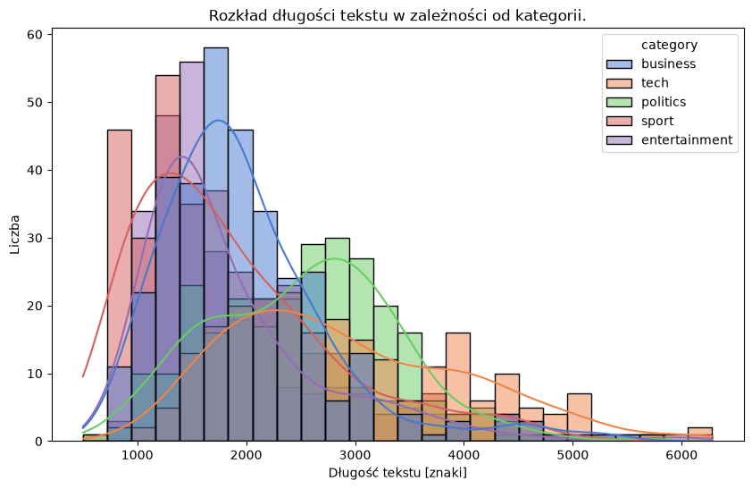
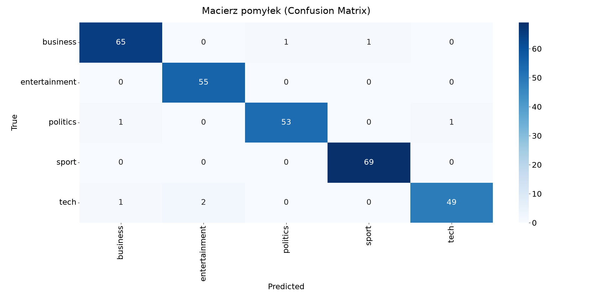
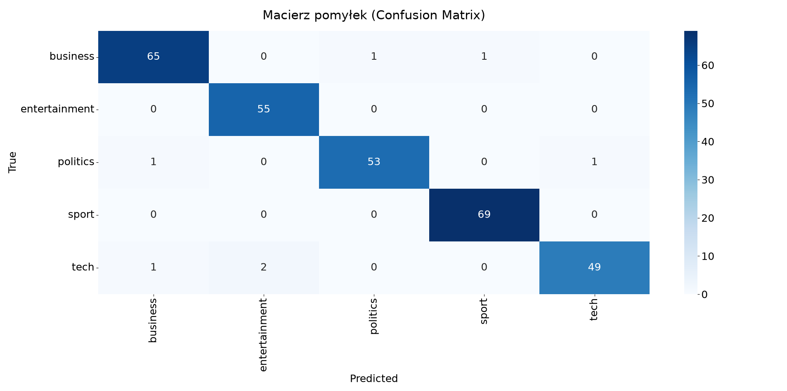

# Klasyfikacja artykułów z podziałem na kategorie

*Celem tego ćwiczenia jest utrwalenie wiedzy z Pythona/NLP przed rozpoczęciem praktyk w firmie WASKO.*

---

**TODO**:
- [x] Krótki opis datasetu
- [x] Opisać najważniejsze obserwacje
- [x] Wynik na Kaggle
- [ ] RAG
- [ ] Dodać sekcję instalacji

---

## Dataset

Zbiór danych podzielony jest na 1490 rekordów do celów szkoleniowych i 735 do testów. Celem jest zbudowanie systemu, który będzie mógł precyzyjnie klasyfikować wcześniej niepublikowane artykuły do odpowiedniej kategorii.

Kategorie docelowe:
- business,
- tech,
- politics,
- sport,
- entertainment.

Część przykładowego tekstu (kategoria: business):
*worldcom ex-boss launches defence lawyers defending former worldcom chief bernie ebbers against a battery of fraud charges have called a company whistleblower as their first witness. cynthia cooper worldcom s ex-head of internal accounting alerted directors to irregular accounting practices at the us telecoms giant in 2002. her warnings led to the collapse of the firm following the discovery of an $11bn (£5.7bn) accounting fraud. mr ebbers has pleaded not guilty to charges of fraud and conspiracy.*

## Budowa prostego modelu predykcyjnego (TF-IDF, SVM)

### Struktura

Struktura projektu przedstawia się następująco:

```nlp_proj/
├── README.md
├── pyproject.toml
├── .gitignore
│
├── data/
│   ├── raw/         # oryginalne pliki CSV
│   └── outputs/     # utworzone pliki CSV
│
├── src/
│   └── text_lab/
│       ├── __init__.py
│       ├── io.py           # wczytywanie/zapis danych
│       ├── clean.py        # czyszczenie tekstu
│       ├── features.py     # TfidfVectorizer, przygotowanie X, y
│       ├── tokenization.py # stemming, Lametyzacja
│       ├── train.py        # trening + zapis modelu
│       └── predict.py      # predykcja na nowym tekście
│
├── notebooks/
│   └── 01_eda.ipynb # eksploracja danych
│
├── tests/
│   ├── test_clean.py
│   └── test_features.py
│
├── models/          # zapisany pipeline (.joblib)
└── main.py
```

Utworzone w ten sposób moduły pozwoliły na stworzenie przejrzystego i prostego do testowania kodu.

---

### Eksporacyjna Analiza Danych (EDA)

Analiza długości tekstu:



Wnioski z całości:
- Obecność duplikatów.
- Lekkie niezbalansowanie klas:

| category | no_cat | perc_of_data |
| :--- | :---: | :---: |
| sport | 342 | 23.75% |
| business | 335 | 23.26% |
| politics | 266 | 18.47% |
| entertainment | 263 | 18.26% |
| tech | 234 | 16.25% |

- Konieczność usunięcia stopwords oraz własnych propozycji słów odrzuconych po analizie.
- Długość tekstu ma wpływ na jego przynależność do danej kategorii.
- Należy ustawić odpowiednią liczbę `max_features` w TF-IDF (34541 unikalnych słów).

---

### Opis rozwiązania

1. **Ładowanie danych**
   - Wykonywane za pomocą `io.py`. Odpowiednia obsługa błędów, podział na typ danych ('train' lub 'test'), normalizacja nazw kolumn.

2. **Przygotowanie zbiorów danych**
   - Wydzielenie zbioru treningowego oraz testowego wraz z podziałem na wartości wejściowe i wyjściowe. Ostatecznie zwracana jest krotka (X_train, X_test, y_train, y_test).

3. **Trenowanie modelu**
   - Zbudowanie potoku danych (pipeline):
     - Wektoryzator słów TF-IDF ze szczegółowo dobraną bazą słów stop (na podstawie analizy) oraz własnym preprocessorem, który został zaimplementowany w module `clean.py` i przetestowany przy użyciu *pytest*.
     - Maszyna wektorów nośnych (SVM). Następnie dobrano zakres parametrów dla obu obiektów w potoku, aby wykonać dostrajanie hiperparametrów za pomocą `GridSearchCV`. Skorzystano z 5-warstwowej walidacji krzyżowej z warstwowym podziałem klas (*stratify=True*). Optymalizowaną metryką było '*f1_macro*'.

4. **Walidacja**

    - Odpowiednio dostrojony model wykorzystano do oceny na zbiorze testowym. Poniżej znajdują się uzyskane wyniki.

        **Raport klasyfikacji**

        | Klasa | Precision | Recall | F1-Score | Support |
        | :--- | :---: | :---: | :---: | :---: |
        | **business** | 0.97 | 0.97 | 0.97 | 67 |
        | **entertainment** | 0.96 | 1.00 | 0.98 | 55 |
        | **politics** | 0.98 | 0.96 | 0.97 | 55 |
        | **sport** | 0.99 | 1.00 | 0.99 | 69 |
        | **tech** | 0.98 | 0.94 | 0.96 | 52 |
        | | | | | |
        | **accuracy** | | | **0.98** | **298** |
        | **macro avg** | 0.98 | 0.98 | 0.98 | 298 |
        | **weighted avg** | 0.98 | 0.98 | 0.98 | 298 |


    - Nagłówki kolumn (*Predicted*) i wierszy (*True*) odpowiadają kolejno klasom: *business, entertainment, politics, sport, tech*.

<!-- 
        **Macierz pomyłek (Confusion Matrix)**

        | Rzeczywiste \ Przewidywane | business | entertainment | politics | sport | tech |
        | :--- | :---: | :---: | :---: | :---: | :---: |
        | **business** | **65** | 0 | 1 | 1 | 0 |
        | **entertainment** | 0 | **55** | 0 | 0 | 0 |
        | **politics** | 1 | 0 | **53** | 0 | 1 |
        | **sport** | 0 | 0 | 0 | **69** | 0 |
        | **tech** | 1 | 2 | 0 | 0 | **49** |
-->



5. **Lematyzacja i Stemming**
    - Zaimoplementowano możliwość wykonania operacji normalizacji tekstu przez odpowiednie flagi parsera. Wykorzystano bibliotekę PyStemmer dla stemmingu oraz spaCy dla lematyzacji, dla której wykorzystano model '*en_core_web_trf*' opierający się na transformerze. Poniżej znajdują się macierze pomyłek dla poszczególnych wersji:

    **Stemming**

    

    **Lematyzacja**

    


6. **Wysłanie na Kaggle**
   - Przygotowany zbiór testowy z konkursu na platformie Kaggle, składający się z 722 rekordów, został przepuszczony przez wytrenowane modele. Uzyskane predykcje zostały wysłane w formacie .csv jako *Late Submission*. Obowiązującą metryką w wyzwaniu była dokładność (*Accuracy*). Udało się osiągnąć wynik na poziomie **0.98367** równy dla każdego utworzonego modelu. Jest to wynik wyższy niż najwyższy rezultat znajdujący się obecnie w tabeli wyników (**0.98231**).

## Źródło

> Bijoy Bose. BBC News Classification. https://kaggle.com/competitions/learn-ai-bbc, 2019. Kaggle.
> Oryginalny zbiór danych: D. Greene and P. Cunningham. "Practical Evaluation of Recommender Systems," In Proc. 3rd International Conference on Mobile Ubiquitous Computing, Systems, Services and Technologies (UBICOMM'09), 2009.
